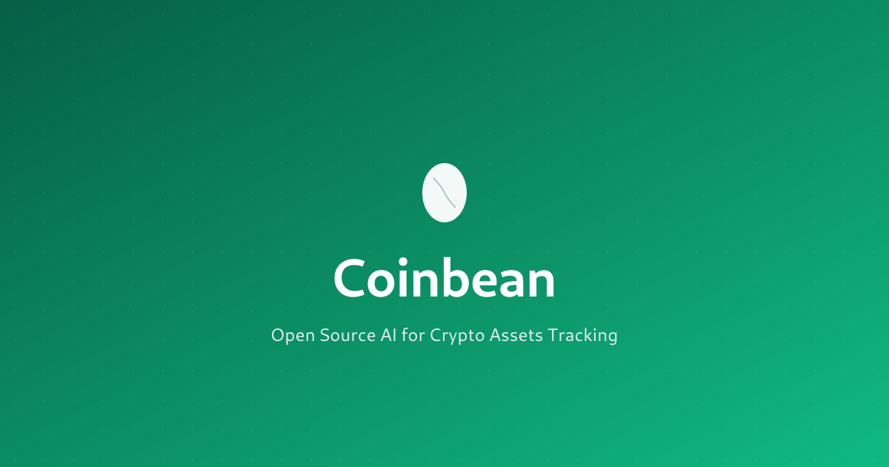

<div align="center">
  
</div>

<div align="center">

Un sistema integral de seguimiento de portafolio de criptomonedas basado en [Beancount](https://github.com/beancount/beancount), el sistema de contabilidad por partida doble.

**Creado por [Boyuan Qian](https://github.com/boyuanqian) @ [QAI Lab](https://github.com/qai-lab)**

[English](README.md) | [简体中文](README_zh.md) | [Français](README_fr.md) | [한국어](README_ko.md) | [日本語](README_ja.md) | Español

---

🌐 [coinbean.org](https://coinbean.org) | 🐦 [x.com/CoinbeanAI](https://x.com/CoinbeanAI)

</div>

## 🎥 Video de demostración

[](https://youtu.be/2TaJvP5Ysfc)

## ⚡ Inicio rápido

### Opción 1: Docker (Recomendado)

```bash
./run.sh  # Seleccione la opción 1 para Docker
# O: docker-compose up -d
```

### Opción 2: Instalación nativa

```bash
./setup.sh              # Instalar dependencias
./run.sh                # Iniciar interfaz web Fava
./prices.sh             # Obtener precios actuales
```

Abra http://localhost:5002 para ver su portafolio.

## ¿Qué es Coinbean?

Rastree su portafolio cripto en exchanges, wallets, DeFi, staking y NFTs usando contabilidad por partida doble.

**Soporta:**
- 10+ exchanges (Coinbase, Binance, Kraken, etc.)
- Wallets de hardware/software (Ledger, MetaMask, Phantom)
- Protocolos DeFi (Aave, Uniswap, Lido, Hyperliquid)
- Staking y yield farming
- NFT (Ethereum, Solana, Bitcoin Ordinals)
- 110+ criptomonedas

## Características

- ✅ Cuentas preconfiguradas para exchanges, wallets y DeFi
- ✅ Soporte de 110+ criptomonedas con obtención automática de precios
- ✅ Seguimiento de NFT y Bitcoin Ordinals
- ✅ Reporte de impuestos con seguimiento de ganancias de capital
- ✅ Hermosa interfaz web (Fava)
- ✅ Soporte Docker para fácil despliegue

## Estructura de archivos

```
coinbean/
├── crypto_main.beancount       # Libro mayor principal (110+ criptos definidas)
├── exchanges.beancount         # Cuentas de exchange
├── chains.beancount            # Wallets y staking
├── defi.beancount              # Protocolos DeFi
├── crypto_prices.beancount     # Datos de precios
├── tx_2025.beancount           # Sus transacciones
├── crypto_examples.beancount   # 20+ ejemplos de transacciones
├── setup.sh / run.sh / prices.sh
└── docker-compose.yml
```

**Edite estos archivos:**
- `tx_2025.beancount` - Agregue sus transacciones
- `exchanges.beancount` - Habilite solo los exchanges que usa
- `chains.beancount` - Agregue sus wallets
- `defi.beancount` - Agregue los protocolos DeFi que usa

## Estructura de cuentas

```
Assets:Crypto
├── Exchange:{Exchange}:{Activo}      # Coinbase:BTC, Binance:ETH
├── Wallet:{Wallet}:{Activo}          # Ledger:BTC, MetaMask:ETH
├── Staking:{Cadena}:{Estado}         # ETH:Delegated, SOL:Rewards
├── DeFi:{Protocolo}:{Activo}         # Aave:USDC, Uniswap:LPTokens
└── NFT:{Cadena}:{Colección}          # Ethereum:BAYC, Solana:DeGods

Income:Crypto
├── Staking:Rewards
├── Trading:CapitalGains
└── Airdrops

Expenses:Crypto
├── Trading:Fees
├── Gas:{Cadena}                      # Ethereum, Solana, etc.
└── Withdrawal:Fees
```

## Registrar transacciones

Consulte `crypto_examples.beancount` para 20+ ejemplos. Formato básico:

```beancount
2025-01-15 * "Coinbase" "Comprar Bitcoin"
  Assets:Crypto:Exchange:Coinbase:BTC      0.1 BTC {60000 USD}
  Assets:Crypto:Exchange:Coinbase:Cash:USD -6000.00 USD
  Expenses:Crypto:Trading:Fees             10.00 USD
```

## Personalización

### Agregar nuevo exchange

Edite `exchanges.beancount`:

```beancount
2020-01-01 open Assets:Crypto:Exchange:TuExchange:Cash:USD
2020-01-01 open Assets:Crypto:Exchange:TuExchange:BTC
2020-01-01 open Assets:Crypto:Exchange:TuExchange:ETH
```

### Agregar nueva criptomoneda

Edite `crypto_main.beancount`:

```beancount
2020-01-01 commodity TU
  name: "Tu Moneda"
  blockchain: "Ethereum"
  category: "DeFi"
```

Luego agregue a `fetch_prices.py`:

```python
Asset('TU', 'Your Coin', 'Ethereum', 'DeFi', 'your-coin-id'),
```

### Deshabilitar módulos no utilizados

Comente en `crypto_main.beancount`:

```beancount
include "exchanges.beancount"
include "chains.beancount"
; include "defi.beancount"  # No usando DeFi
```

## Comandos

| Comando | Propósito |
|---------|-----------|
| `./run.sh` | Iniciar Fava (menú interactivo) |
| `./prices.sh` | Obtener precios actuales de criptos |
| `bean-check crypto_main.beancount` | Validar libro mayor |
| `bean-query crypto_main.beancount "SELECT..."` | Consultar datos |
| `docker-compose up -d` | Iniciar con Docker |
| `docker-compose logs -f` | Ver logs de Docker |

## Reporte de impuestos

**Eventos imponibles rastreados automáticamente:**
- Ganancias/pérdidas de capital (ventas de cripto, swaps)
- Recompensas de staking (como ingreso)
- Airdrops (como ingreso)
- Rendimiento DeFi (como ingreso)

**Generar reportes:**

```bash
# Ver todas las ganancias de capital
bean-query crypto_main.beancount "
  SELECT date, account, sum(position)
  WHERE account ~ 'CapitalGains'
  ORDER BY date"

# Ver ingresos de staking
bean-query crypto_main.beancount "
  SELECT date, sum(position)
  WHERE account ~ 'Staking:Rewards'"
```

## Seguridad

⚠️ **Importante:** Nunca commitee datos financieros sin encriptar a repositorios públicos.

**Use git-crypt para encriptar archivos sensibles:**

```bash
brew install git-crypt
git-crypt init
echo "*.beancount filter=git-crypt diff=git-crypt" >> .gitattributes
echo "tx_*.beancount filter=git-crypt diff=git-crypt" >> .gitattributes
```

## Solución de problemas

| Problema | Solución |
|----------|----------|
| Errores de `bean-check` | Verificar nombres de cuentas, asegurar que las transacciones estén balanceadas |
| Los precios no se muestran | Ejecutar `./prices.sh`, verificar `crypto_prices.beancount` |
| Desajuste de saldo | Revisar todas las transacciones, verificar comisiones faltantes |
| Fava no inicia | Verificar si el puerto 5002 está en uso, intentar `./run.sh -p 5003` |
| Problemas con Docker | Verificar logs con `docker-compose logs` |

## Recursos

- 📦 [Repositorio GitHub](https://github.com/qai-lab/coinbean)
- 📋 [Notas de versión](https://github.com/qai-lab/coinbean/releases)
- 🌐 [Sitio web Coinbean](https://coinbean.org/)
- 🐦 [Seguir en X/Twitter](https://x.com/CoinbeanAI)
- 📚 [Documentación Beancount](https://beancount.github.io/docs/)
- 🖥️ [Documentación Fava](https://github.com/beancount/fava)

## Autor

**Creado por:**
- **Boyuan Qian** - [@boyuanqian](https://github.com/boyuanqian) | [@boyuan_qian](https://x.com/boyuan_qian)

**Organización:**
- **QAI Lab** - [qai.io](https://qai.io) | [@qai-lab](https://github.com/qai-lab) | [@qai_lab](https://x.com/qai_lab)

## Licencia

Licencia MIT - Copyright (c) 2025 Boyuan Qian y QAI Lab. Ver archivo [LICENSE](LICENSE).

## Descargo de responsabilidad

Esta herramienta es solo para seguimiento de portafolio personal. No proporciona asesoramiento financiero, fiscal o de inversión. Las inversiones en criptomonedas conllevan riesgos. Consulte a profesionales calificados para asuntos financieros y fiscales.

---

**¡Feliz seguimiento! 📊**
