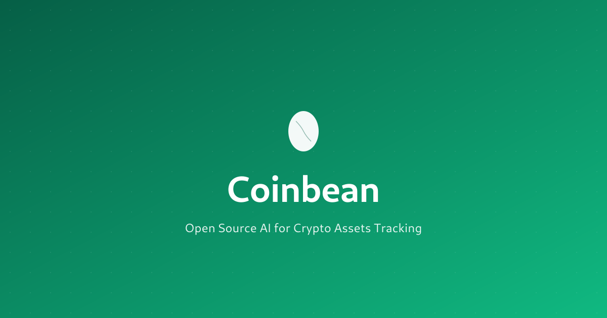

<div align="center">
  
</div>

<div align="center">

Coinbean AI - 复式记账、综合加密货币投资组合跟踪系统。

🌐 [coinbean.org](https://coinbean.org) | 🐦 [x.com/CoinbeanAI](https://x.com/CoinbeanAI)

[English](README.md) | 简体中文 | [Français](README_fr.md) | [한국어](README_ko.md) | [日本語](README_ja.md) | [Español](README_es.md)

---

**由 [Boyuan Qian](https://github.com/boyuanqian) @[QAI Lab](https://github.com/qai-lab) 创建**

</div>

## 🎥 演示视频

[](https://youtu.be/2TaJvP5Ysfc)

## ⚡ 快速开始

### 选项 1：Docker（推荐）

```bash
./run.sh  # 选择选项 1 使用 Docker
# 或：docker-compose up -d
```

### 选项 2：原生安装

```bash
./setup.sh              # 安装依赖
./run.sh                # 启动 Fava Web 界面
./prices.sh             # 获取当前价格
```

在浏览器打开 http://localhost:5002 查看您的投资组合。

## Coinbean 是什么？

使用复式记账跟踪您在交易所、钱包、DeFi、质押和 NFT 上的加密货币投资组合。

**支持：**

- 10+ 个交易所（Coinbase、Binance、Kraken 等）
- 硬件/软件钱包（Ledger、MetaMask、Phantom）
- DeFi 协议（Aave、Uniswap、Lido、Hyperliquid）
- 质押和流动性挖矿
- NFT（Ethereum、Solana、Bitcoin Ordinals）
- 110+ 种加密货币

## 功能特性

- ✅ 为交易所、钱包和 DeFi 预配置账户
- ✅ 支持 110+ 种加密货币，自动获取价格
- ✅ NFT 和比特币序数跟踪
- ✅ 税务报告和资本利得跟踪
- ✅ 精美的 Web 界面（Fava）
- ✅ Docker 支持，易于部署

## 文件结构

```
coinbean/
├── crypto_main.beancount       # 主账本（定义了 110+ 种加密货币）
├── exchanges.beancount         # 交易所账户
├── chains.beancount            # 钱包和质押
├── defi.beancount              # DeFi 协议
├── crypto_prices.beancount     # 价格数据
├── tx_2025.beancount           # 您的交易
├── crypto_examples.beancount   # 20+ 个示例交易
├── setup.sh / run.sh / prices.sh
└── docker-compose.yml
```

**编辑这些文件：**

- `tx_2025.beancount` - 添加您的交易
- `exchanges.beancount` - 仅启用您使用的交易所
- `chains.beancount` - 添加您的钱包
- `defi.beancount` - 添加您使用的 DeFi 协议

## 账户结构

```
Assets:Crypto
├── Exchange:{交易所}:{资产}         # Coinbase:BTC, Binance:ETH
├── Wallet:{钱包}:{资产}             # Ledger:BTC, MetaMask:ETH
├── Staking:{链}:{状态}              # ETH:Delegated, SOL:Rewards
├── DeFi:{协议}:{资产}               # Aave:USDC, Uniswap:LPTokens
└── NFT:{链}:{收藏品}                # Ethereum:BAYC, Solana:DeGods

Income:Crypto
├── Staking:Rewards
├── Trading:CapitalGains
└── Airdrops

Expenses:Crypto
├── Trading:Fees
├── Gas:{链}                        # Ethereum, Solana 等
└── Withdrawal:Fees
```

## 记录交易

查看 `crypto_examples.beancount` 了解 20+ 个示例。基本格式：

```beancount
2025-01-15 * "Coinbase" "购买比特币"
  Assets:Crypto:Exchange:Coinbase:BTC      0.1 BTC {60000 USD}
  Assets:Crypto:Exchange:Coinbase:Cash:USD -6000.00 USD
  Expenses:Crypto:Trading:Fees             10.00 USD
```

## 自定义

### 添加新交易所

编辑 `exchanges.beancount`：

```beancount
2020-01-01 open Assets:Crypto:Exchange:YourExchange:Cash:USD
2020-01-01 open Assets:Crypto:Exchange:YourExchange:BTC
2020-01-01 open Assets:Crypto:Exchange:YourExchange:ETH
```

### 添加新加密货币

编辑 `crypto_main.beancount`：

```beancount
2020-01-01 commodity YOUR
  name: "您的币"
  blockchain: "Ethereum"
  category: "DeFi"
```

然后添加到 `fetch_prices.py`：

```python
Asset('YOUR', 'Your Coin', 'Ethereum', 'DeFi', 'your-coin-id'),
```

### 禁用未使用的模块

在 `crypto_main.beancount` 中注释：

```beancount
include "exchanges.beancount"
include "chains.beancount"
; include "defi.beancount"  # 不使用 DeFi
```

## 常用命令

| 命令                                           | 用途                    |
| ---------------------------------------------- | ----------------------- |
| `./run.sh`                                     | 启动 Fava（交互式菜单） |
| `./prices.sh`                                  | 获取当前加密货币价格    |
| `bean-check crypto_main.beancount`             | 验证账本                |
| `bean-query crypto_main.beancount "SELECT..."` | 查询数据                |
| `docker-compose up -d`                         | 使用 Docker 启动        |
| `docker-compose logs -f`                       | 查看 Docker 日志        |

## 税务报告

**自动跟踪应税事件：**

- 资本利得/损失（加密货币销售、交换）
- 质押奖励（作为收入）
- 空投（作为收入）
- DeFi 收益（作为收入）

**生成报告：**

```bash
# 查看所有资本利得
bean-query crypto_main.beancount "
  SELECT date, account, sum(position)
  WHERE account ~ 'CapitalGains'
  ORDER BY date"

# 查看质押收入
bean-query crypto_main.beancount "
  SELECT date, sum(position)
  WHERE account ~ 'Staking:Rewards'"
```

## 安全

⚠️ **重要：** 切勿将未加密的财务数据提交到公共存储库。

**使用 git-crypt 加密敏感文件：**

```bash
brew install git-crypt
git-crypt init
echo "*.beancount filter=git-crypt diff=git-crypt" >> .gitattributes
echo "tx_*.beancount filter=git-crypt diff=git-crypt" >> .gitattributes
```

## 故障排除

| 问题              | 解决方案                                           |
| ----------------- | -------------------------------------------------- |
| `bean-check` 错误 | 检查账户名称，确保交易平衡                         |
| 价格未显示        | 运行 `./prices.sh`，检查 `crypto_prices.beancount` |
| 余额不匹配        | 查看所有交易，检查遗漏的费用                       |
| Fava 无法启动     | 检查端口 5002 是否被占用，尝试 `./run.sh -p 5003`  |
| Docker 问题       | 使用 `docker-compose logs` 查看日志                |

## 资源

- 📦 [GitHub 存储库](https://github.com/coinbean/coinbean)
- 📋 [发布说明](https://github.com/coinbean/coinbean/releases)
- 🌐 [Coinbean 网站](https://coinbean.org/)
- 🐦 [在 X/Twitter 关注](https://x.com/CoinbeanAI)
- 📚 [Beancount 文档](https://beancount.github.io/docs/)
- 🖥️ [Fava 文档](https://github.com/beancount/fava)

## 作者

**创建者：**

- **Boyuan Qian** - [@boyuanqian](https://github.com/boyuanqian) | [@boyuan_qian](https://x.com/boyuan_qian)

**组织：**

- **QAI Lab** - [qai.io](https://qai.io) | [@qai-lab](https://github.com/qai-lab) | [@qai_lab](https://x.com/qai_lab)

## 许可证

MIT 许可证 - 版权所有 (c) 2025 Boyuan Qian 和 QAI Lab。详见 [LICENSE](LICENSE) 文件。

## 免责声明

此工具仅用于个人投资组合跟踪。它不提供财务、税务或投资建议。加密货币投资存在风险。对于财务和税务事宜，请咨询合格的专业人士。

---

**祝跟踪愉快！ 📊**
